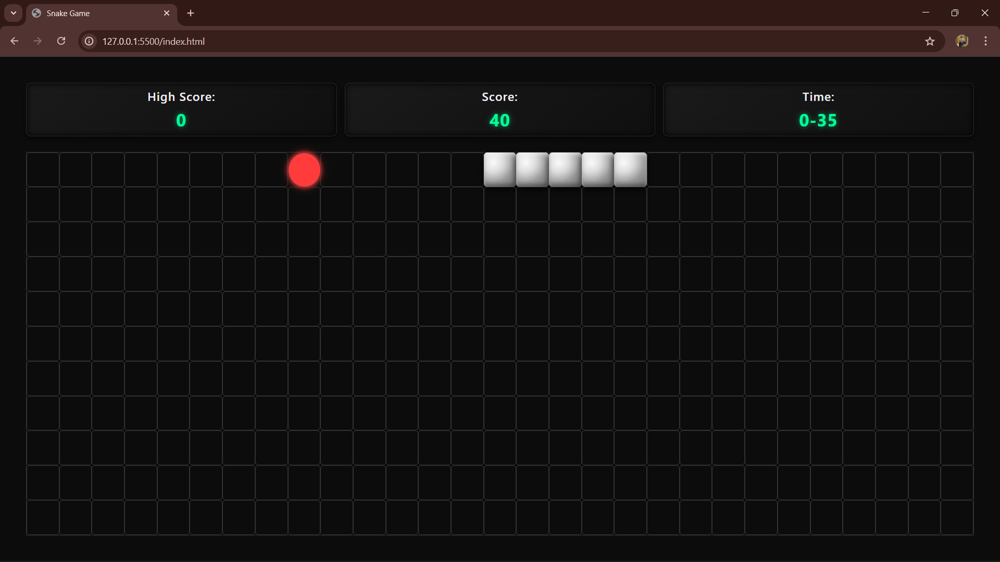

<h1 align="center">🐍 NeonSnake Arena</h1>

<p align="center">
  <b>A modern, responsive Snake Game with glowing neon design, keyboard & mobile controls, and high score tracking – built with HTML, CSS, and JavaScript.</b>
</p>

<p align="center">
  
  
  
</p>

---

## 🚀 Tech Stack

- **Frontend:** HTML5, CSS3, Vanilla JavaScript  
- **Responsive UI:** Grid-based layout & neon glow animations  
- **Storage:** Browser `localStorage` for high score tracking  

---

## 🧩 Core Features

- 🟩 **Snake Movement** – Smooth grid-based motion  
- 🍎 **Food Collection** – Eat food to grow and score points  
- ⬆️⬇️⬅️➡️ **Controls** – Keyboard & mobile-friendly buttons  
- 🕒 **Timer** – Tracks how long you play  
- 💾 **High Score** – Stored in browser for persistent tracking  
- 🖥️ **Responsive Design** – Optimized for desktop & mobile  
- 🔄 **Restart & Game Over** – Start a new game seamlessly  

---

## 📋 Prerequisites

- Modern browser (Chrome, Edge, Firefox)  
- No server required – works completely in browser  

---

## 📂 Project Structure
```
neon-snake-arena/
├── index.html        # Main HTML file
├── style.css         # Neon UI & responsive styles
├── script.js         # Game logic & controls
├── game.png          # Game icon 
├── screenshots/
│   ├── start-game.png
│   ├── playing-game.png
│   └── game-over.png
└── README.md
```

---

## 🚀 How to Run the Project

1. Clone the repository or download the ZIP
2. Open `index.html` in your browser
3. Click **Start Game**
4. Control the snake using:
   - Arrow keys (Desktop)
   - On-screen buttons (Mobile)

---

## 🔥 Live Demo

🌍 **Live Website:**
[https://neon-snake-arena.vercel.app/](https://neon-snake-arena.vercel.app/)

---

## 🎮 Game Controls

| Platform | Controls |
|--------|----------|
| Desktop | Arrow Keys (↑ ↓ ← →) |
| Mobile | On-screen arrow buttons |

---

## 📱 Responsive Design

- Automatically adapts to different screen sizes
- Touch controls appear on mobile devices
- Optimized layout for small screens

---

## 🧠 Game Logic Overview

- Snake moves at fixed intervals
- Food appears randomly on the grid
- Eating food increases snake length and score
- Game ends when the snake:
  - Hits the wall
  - Collides with itself
- High score is stored using browser localStorage

---

## 📸 Preview

<p align="center">
  
  
  
</p>

---

## 📄 License

This project is open-source and free to use for **learning and academic** purposes.

---

## 👨‍💻 Author

**Karan Singh**  
🎓 B.Tech CSE | 💻 Full-Stack Developer | 🤝 Open Source Enthusiast  
📧 [karan.devmail@gmail.com](mailto:karan.devmail@gmail.com)  
🔗 [LinkedIn](https://www.linkedin.com/in/bitkaran/) | [GitHub](https://github.com/bitkaran)

---

## 💡 Philosophy

> _“Keep building, keep learning — and the right opportunity will find you.”_


If you like this project, feel free to ⭐ the repository!
